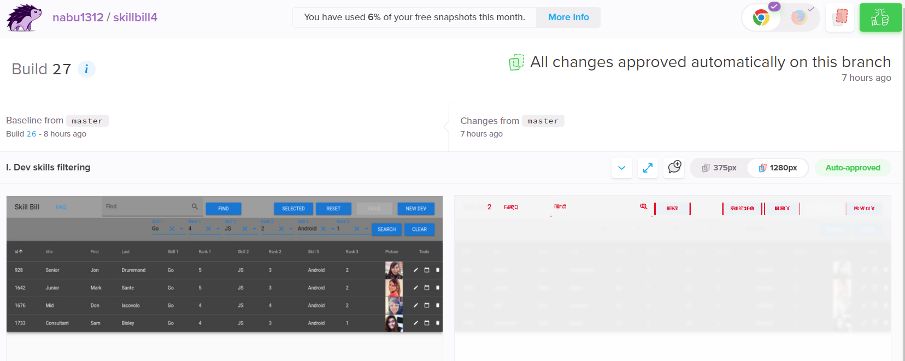

# Cypress: hands-on instruction (BDD, visual regression)

[1. Installation](#1-Installation)

[2. Usage](#2-Usage)

[3. Example test and key commands](#3-Example-test-and-key-commands)

[4. Headful vs headless](#4-Headful-vs-headless)

[5. BDD](#5-BDD)

[6. Plain test vs BDD test](#6-Plain-test-vs-BDD-test)

[7. Visual regression testing](#7-Visual-regression-testing)

[8. Visual regression testing - Percy](#8-Visual-regression-testing---Percy)

[9. FAQ](#9-faq)

## 1. Installation

  Because of restrictions caused by corporate proxies, use below quick fix:

    1. git clone ...
    2. export NODE_TLS_REJECT_UNAUTHORIZED=0 (or ‘set’ for Windows)
    3. npm i
    4. set NODE_TLS_REJECT_UNAUTHORIZED=1 (reenables checking TLS certificates)
    5. npm i json-server (or npm i -g json-server)

## 2. Usage

  To start Cypress, you need to start your project first
  In case of this particular project, since json data is served from local server, start json-server first

    1. json-server db2.json (starts local json server with db2.json data)
    2. npm run serve        (starts the application)
    3. npx cypress open     (starts cypress in headful mode; select Electron)
       or npx cypress run   (starts cypress in headless mode)

## 3. Example test and key commands

  Tests should be stored in **/cypress/integration/** folder and should have **'.spec.js'** suffix

  Please open: cypress/integration/skillbill.spec.js file

### I. Commands

  As you can see, tests are grouped in suites, using 'describe' clause, followed by general description
    of the goal of all below included tests and anonymous function.

  Inside, individual tests follow with 'it' clause, description of the current test and its body,
    including initial activity and assertion which is verified:

  Each cypress command starts from 'cy.' prefix (unless it is chained from 'cy.' command)

      describe('I. Dev skills filtering', () => {
        it.only('1. .. selecting Go=4, JS=2 and Android=1, should get at least 3 devs' +
          ' and pressing Clear button should clear all the select boxes', () => {
            cy.visit('http://localhost:8080')                // activity
            cy.get('body').should('contain', 'Hello World')  // assertion)
          })
      })

  [The most frequently used commands](https://docs.cypress.io/api/commands/and.html#Syntax)

  **1. cy.log(text)**

    Print comment in the log panel of Cypress headfull
      ex: cy.log('App start ...')

  **2. cy.visit(url)**

    Connect to the selected url

  **3. cy.get(el)**

    Get one or more DOM elements by selector or alias
      ex: cy.get("[data-test='filter_skill_1']")

  **4. cy.click(el) and cy.dblclick(el)**

    Click DOM element

  **5. cy.scrollTo(x, y)**

    Scroll to a specific position

  **6. cy.type(text)**

    Type into a DOM element

  **7. cy.focus(el)**

    Focus on a DOM element

  **8. cy.trigger(eventName)**

    Trigger an event on a DOM element
      ex: cy.get('a').trigger('mousedown')

  **9. .should()**

   Create an [assertion](https://docs.cypress.io/guides/references/assertions.html#Chai). Assertions are automatically retried until they pass or time out

    ex: cy.get('el').should('contain', 'Go')

  **10. .contains()**

    Get the DOM element containing the text.
    DOM elements can contain more than the desired text and still match

  **11. cy.wait(ms)**

    Delays further execution

  **12. cy.pause()**

    Pauses further execution and lets you continue clicking on Resume or Step button

### II. Selectors

  [Selecting-Elements](https://docs.cypress.io/guides/references/best-practices.html#Selecting-Elements)

  To avoid issues with CSS selectors, which may change their names or be remove each DOM element which might be selected by Cypress, should have 'data-test' or 'data-cy' attribute

    ex HTML:    <v-text-field data-test="email"></v-text-field>
       cypress: cy.get("[data-test='email']")

## 4. Headful vs headless

  Cypress may be run in one of two modes:

  a) headful - with GUI including browser window (for test debugging)

  b) headless - with command line environment only (for regular testing, once test is working properly)

    npx cypress open (opens GUI for headful mode)
    npx cypress run  (executes all tests in command line)
    npx cypress run --spec **/skillbill*.* (executes only selected test(s))

## 5. BDD

  [BDD](https://cucumber.io/docs/bdd)

  BDD stands for Behavior-Driven-Development and is an alternative to Test-Driven-Development for writing tests.

  Cypress-cucumber-preprocessor package implements BDD syntax for Cypress.

  Below, you install it, create test files (.feature and .js) and run it (headful and headless):

```bash
      1. npm i -D cypress-cucumber-preprocessor@1.17.0

      2. cypress.json, add:
          {
            "baseUrl": "http://localhost:8080",
            "viewportWidth": 1600,
            "viewportHeight": 900,
            "video": false,
            "screenshotsFolder": "cypress/snapshots",
            "trashAssetsBeforeRuns": true,
            "chromeWebSecurity": false
          }

      3. package.json, add:

          "cypress-cucumber-preprocessor": {
            "nonGlobalStepDefinitions": true
          }

      4. plugins/index.js, add:
           const cucumber = require('cypress-cucumber-preprocessor').default

           module.exports = (on, config) => {
             on('file:preprocessor', cucumber())
           }
```

      5. Create .feature file containing BDD scenario, in the follwoing format:

          cypress/integration/SkillBill.feature:

          Feature: The SkillBill

          I want to open SkillBill page

          Scenario: Testing database filtering
            Given I open SkillBill page

            When I click on Skill_1 dropdown and select "Go"
            When I click on Rank_1 dropdown and select "4"
            (...)
            When I click on Search button

            Then I see the 1st row with Go=4+ (...)

      6. Create the test file, strictly matching above scenario instructions
          cypress/integration/SkillBill/test.js (fragment)

  ```js
          const url = 'http://localhost:8080'

          Given('I open SkillBill page', () => {
            cy.visit(url)
          })

          When('I click on Skill_1 dropdown and select "Go"', () => {
            cy.get("[data-test='filter_skill_1']").click({ force: true })
            cy.get('div.menuable__content__active div:nth-child(4) a div div').click()
          })

          When('I click on Rank_1 dropdown and select "4"', () => {
            cy.get("[data-test='filter_rank_1']").click({ force: true })
            cy.get('div.menuable__content__active div:nth-child(2) a div div').click()
          })

          (...)

          When('I click on Search button', () => {
            cy.get("[data-test='btnSearch']").click() // .wait(2000)
          })

          Then('I see the 1st row with Go=4+, JS=2+ and Android=1+', () => {
            cy.get(tableCell(1, 5)).should('contain', 'Go')
            cy.get(tableCell(1, 6)).contains(/[4,5]/).should('exist')
```

      7. run cypress headful and click on SkillBill.feature:
           npx cypress open

      8.  run cypress headless, selecting only SkillBill.feature file:
           npx cypress run --spec "**/SkillBill.feature"

## 6. Plain test vs BDD test

  Below are screenshots from headful execution of plain test and BDD test.
  As you may see, at the execution level, they do not differ much

  ### 1. Headful: plain test
  

  ### 2. Headful: BDD test
  

  ### 3. Headless: plain test
  

  ### 4. Headless: BDD test
  

  **BDD pros:**

    Product Owner may write BDD .feature test (Given / When / Then)

  **BDD cons:**

    More code, so slower to create

  **Remarks**

    BDD test may seem to be more descriptive, but plain test may catch-up, adding logs.

## 7. Visual regression testing

  [Cypress-visual testing solutions](https://docs.cypress.io/plugins/#visual-testing)

  Visual regression solution lets you avoid mistakenly introducing even tiny graphical changes like a letter, dot, pixel color, margin or padding size

  Cypress webpage, lists 4 npm packages:

      1. cypress-image-snapshot
      2. cypress-visual-regression
      3. cypress-plugin-snapshots
      4. cypress-blink-test

  Unfortunately, due to buggy Cypress screenshot engine, all above npm packages show frequent false-positives
  (see Cypress issues:
  [5876](https://github.com/cypress-io/cypress/issues/5876),
  [2176](https://github.com/cypress-io/cypress/issues/2175)
  )

  Two below platforms work ok, though:

  [Applitools](https://applitools.com/tutorials/cypress.html) - slightly complex GUI, unclear pricing

  [Percy](https://percy.io)      - easy GUI, $29/mth for up to 10k snapshots

## 8. Visual regression testing - Percy

  1. create an account on [Percy.io](https://percy.io) webpage

  2. create a new project, clicking on the 'New project' button

  3. click the new_project_name link, click 'Project settings' tab and find the token

  4. run json-server: json-server db2.json

  5. run your local project: npm run serve

  First two of the following steps, please do in the same terminal window:

  1. export PERCY_TOKEN=the_token (see 3.)

  2. npx percy exec -- cypress run --spec **/skillbill.spec.js

  3. ctrl (cmd) + click on displayed link or
       open percy.io > your project name > Builds tab and click on '1 total snapshot' link

  4. make some (minor) visual change in your project and repeat steps h) and i) to see if snapshot has changed.

### Percy.io dashboard

  **a) top page - summary of snapshots**

  

  **b) initial snapshot or snapshot with no visual changes**

  

  **c) snapshot showing only visual differences (in red)**

    The only change introduced, was digit '2' appended to the 'SkillBill' title


  

  **d) snapshot before and after**

  

## 9. FAQ

### 1. In headful mode, why to choose Electron over Chrome or Chromium?

    Historically, Electron has been much more stable, than the others

### 2. Why so ugly CSS selectors as below?

    cy.get('div.menuable__content__active div:nth-child(4) a div div')

   .. instead of recommended here 'data-*' attribute ?

    The reason is vuetify. Some of its controls are not native HTML ones, but mixture of divs. For example 'select' dropdown.
    Because of that, one can not asssign class nor id to them, so quick fix is to use CSS selector

### 3. Why wait's are used?

    For the most part, Cypress does a good job waiting long enough (4 secs by default), so DOM elements are there.

    Sometimes however, Cypress acts quicker than browser's rendering engine and some artifacts still remain on the screen,
    while in reality they would already be hidden. In most cases, delays of 200-1,000 ms are sufficient.

### 4. Why scrollTo was used?

    Sometimes, Cypress incorrectly scrolls the window down, making top part of the window not visible.
    Quick fix, is to use scrollTo(0,0) then.
